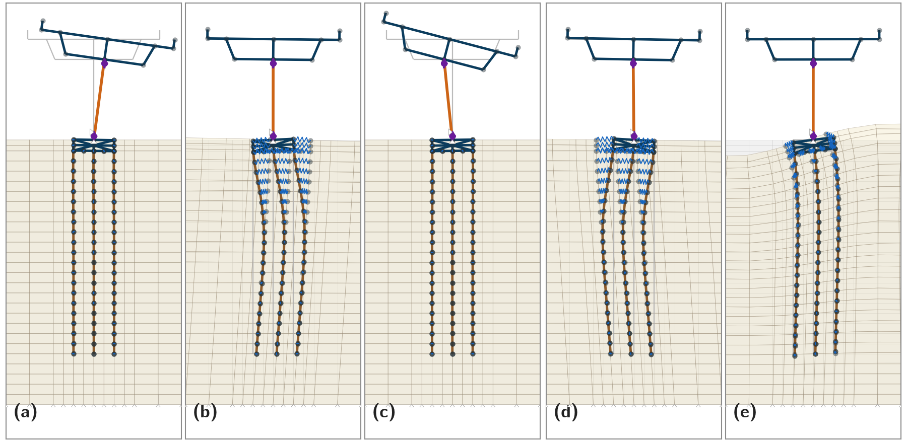

# Modal notes (this domain)

Gravity + holdPier eigen, Shin BC, SSPquad, soil profile 4. Frequencies are
**mesh 0** (Fri Baseline). Mesh 19 (Wed) matches through $f_4$; above that the
numbers move only a little. JSON lives in `plot/out/eigen/mesh<N>/`.
`PlotHydroSpectra.py` draws $f_1$, $f_4$, $f_5$, $f_\mathrm{SSI}$, and
$f'_\mathrm{SSI}$ from those files.

## Modes that show up in the RTHS spectra

### $f_1$ ≈ 0.48 Hz (T ≈ 2.10 s)

Fundamental lateral mode of the pier–deck.

### $f_4$ ≈ 2.98 Hz — pier, hinge rotation

Second pier mode. The column bends and the deck rocks; most of the curvature
lands in the lumped hinges (base and top). Piles stay nearly straight. This is
the line that sits on the strong ~3 Hz peaks in pier-top $u_x$ and actuator
force (Wed and Fri).

### $f_5$ ≈ 3.29 Hz — piles in the soil

Piles take an S-curve (double curvature) while the cap rotates a bit and the
pier rides along. Local soil next to the shafts moves with them; the far field
does not. Mark it so the shoulder just above the 3 Hz peak is not confused with
$f_4$.

### ~8 Hz soil poles — $f_\mathrm{SSI}$, $f'_\mathrm{SSI}$

Pier $u_x$ PSDs have twin bumps near **8.0** and **8.8** Hz. Soil $\gamma$
and p-y light up harder there than the pier does. Not wave harmonics, not
$f_\mathrm{act}$. They are standing waves of the finite soil box:

| | mesh 0 | mesh 19 |
|---|--------|---------|
| $f_\mathrm{SSI}$ | 7.99 Hz (m24/m25) | 7.99 Hz (m26/m27) |
| $f'_\mathrm{SSI}$ | 8.83 Hz (m29) | 8.85 Hz (m30) |

The 7.99 Hz pair is locked across meshes −2 / 0 / 2 / 4. The upper twin drifts
~1–2% when you refine. Poles of this domain, not a Baseline Δx quirk.

Paper figure (lumped + hold; modes 1, 4, 5, 2, 25):



## The rest of the list

Between $f_5$ and ~7.5 Hz the eigen file fills with more soil/SSI modes once
you ask for 30–40. They do not stick out on the lab PSDs the way $f_1$,
$f_4$, and the ~8 Hz pair do. Past ~10 Hz you are into transfer-system /
noise (`f_act` on the hydro plots).

## Regenerate shapes

```text
OpenSees Run.tcl analysis/_Overrides_eigen_compare_lumped_hold.tcl
python plot/PlotEigenModesPaper.py
```

`nModesEigen` needs to be 30+ (`Parameters.tcl`; eigen overrides use 40) or the
8 Hz modes never reach the JSON.
