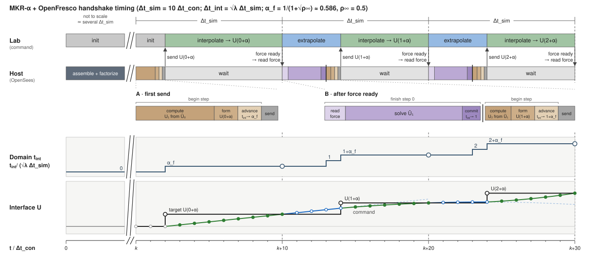
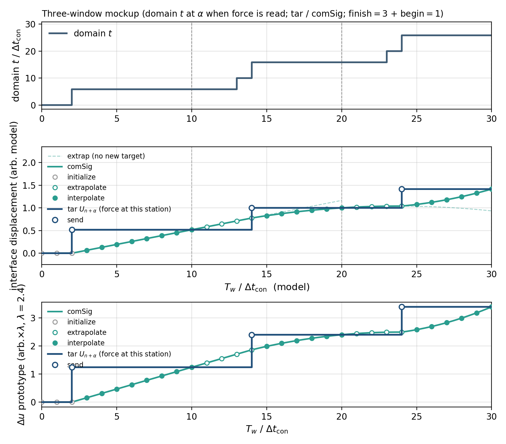

# MKR-α + OpenFresco: what the actuator does each step

Walkthrough of how `MKRAlphaExplicitMultiSOE` / `CudaMKRAlpha` couples to
`expElement generic` + SCRAMNetGT + Simulink predictor–corrector in this repo.
Companion to `STATEOS_SIGNALS.md` (how to read `stateOS` on the mats).

Wiring in `Run.tcl` / `RunParallel.tcl` (`realTimeON 1`):

- trial → lab: UX displacement only (`expControlPoint` disp)
- lab → host: force only (`daqForce`)
- no time / \(\alpha_f\) signal on SCRAMNet

---

## 1. What MKR asks for

MKR forms equilibrium at the weighted station \(t_n + \alpha_f\Delta t\), not at
\(t_{n+1}\). For `MKRAlphaExplicitMultiSOE` / `CudaMKRAlpha` with
\(\rho_\infty^{\mathrm{eq}}=0.5\),

\[
\alpha_f=\frac{1}{1+\sqrt{\rho_\infty^{\mathrm{eq}}}}=2-\sqrt{2}\approx 0.5858
\]

(not the KR-α map \(\alpha_f=1/(1+\rho)=2/3\)).

Inside `newStep` (ExplicitAlpha / MKR family):

1. **Predict** \(U_{n+1}\) and \(\dot U_{n+1}\) from the previous acceleration
   (explicit — no lab call yet).
2. Form \(U_{n+\alpha_f} = (1-\alpha_f)U_n + \alpha_f U_{n+1}\).
3. Put that on the nodes; advance domain time to \(t_n + \alpha_f\Delta t\).
4. `updateDomain` → `EEGeneric::update` → `setTrialResponse` (ctrlDisp =
   \(U_{n+\alpha_f}\)).
5. Residual / `getResistingForce` → `acquire()` waits for `atTarget`, then
   reads `daqForce`.
6. That force is used to **solve \(\ddot U_{n+1}\)**.
7. `commit`: domain time \(+= (1-\alpha_f)\Delta t\) → \(t_{n+1}\). No second
   lab move (`ECSCRAMNetGT::commitState` is a no-op).

So the physical force updates **acceleration**. Displacement \(U_{n+1}\) was
already predicted before the handshake.

Numerical elements evaluate \(P_r(U_{n+\alpha_f})\) constitutively. The
generic element does not: it commands \(U_{n+\alpha_f}\) and returns the
measured force at `atTarget`.

---

## 2. What the lab knows

Simulink never sees \(n\), \(n+\alpha_f\), or \(n+1\). Each handshake is:

1. Host writes target disp, raises `newTarget` (`switchPC` ack).
2. Over the current \(\Delta t_\mathrm{sim}\) window: **extrapolate** until the
   target lands, then **interpolate** toward it (`typeConv3` 1 → 0).
3. End of window: `atTarget`; host reads force.

Arrival deadline = end of that \(\Delta t_\mathrm{sim}\), not “OpenSees
\(t_{n+1}\)”. The value tracked is whatever OpenSees sent — for MKR,
\(U_{n+\alpha_f}\).

Default `-updateElemDisp` off: after the force read, commit does not send
\(U_{n+1}\). The actuator walks successive **\(\alpha\)-stations**, not the
pure nodal \(U_n, U_{n+1}\) (unless \(\alpha_f = 1\)).

“Behind” relative to host end-of-step: when OpenSees has committed \(U_{n+1}\),
the last imposed target is still \(U_{n+\alpha_f}\). The DOF does not sit
frozen — extrapolation / interpolation at \(\Delta t_\mathrm{con}\) keeps
`comSig` moving (unless slowdown).

---

## 3. Mockup (no similitude, with solve time)

Assumptions (illustrative sub-ms stamps):

| Quantity | Value |
|----------|--------|
| \(\Delta t = \Delta t_\mathrm{int} = \Delta t_\mathrm{sim}\) | \(0.010\,\mathrm{s}\) |
| \(\Delta t_\mathrm{con}\) | \(0.001\,\mathrm{s}\) → \(N = 10\) counts / window |
| \(\alpha_f\) | \(2-\sqrt{2}\approx 0.5858\) → \(\alpha_f\Delta t \approx 0.0059\,\mathrm{s}\) (mock \(\Delta t=0.010\)) |
| Host work after each force | ~\(4\,\mathrm{ms}\) / count ~4 (read / solve / commit / predict / form / send) — ~40% of window extrapolate, ~60% interpolate (healthy-run order; cf. `STATEOS_SIGNALS.md` ~37% extrap) |
| First begin-step (before any force) | ~\(2\,\mathrm{ms}\) (predict \(U_1\) / form \(U_{0+\alpha}\) / send) — not instantaneous; no prior solve |
| Healthy run | later targets land ~count 4; no slowdown |

Clocks: \(T_w\) = lab / wall time; \(t\) = OpenSees domain time.
“Actuator” below means the command path (`comSig`); measured disp lags a bit.

### Start

| \(T_w\) | Domain \(t\) | Lab | Host |
|---:|---:|---|---|
| 0.0000 | 0.0000 | at \(U_0\) | committed \(U_0,\dot U_0,\ddot U_0\) |

### Enter step \(0\to1\) (first begin-step — a bit expensive)

No prior force/solve; still more host work than the short predict–form–send
tail after later commits (cold start / first `newStep`).

| \(T_w\) | Domain \(t\) | Lab | Host |
|---:|---:|---|---|
| 0.0000 | 0.0000 | window 0, count 1 | **begin step:** predict \(U_1\) from \(\ddot U_0\) |
| 0.0008 | 0.0000 | count 1–2 | form \(U_{0+\alpha}\) (in progress) |
| 0.0015 | **0.0059** | count 2 | set domain time to \(0+\alpha\) |
| **0.0020** | 0.0059 | receives target | **send** \(U_{0+\alpha}\) |
| 0.0021 | 0.0059 | extrap → interp | **block** on `atTarget` |

### Window 0 (host waiting)

| \(T_w\) | count | Lab | Domain \(t\) | Host |
|---:|---:|---|---:|---|
| 0.0021–0.0060 | 3–7 | interp toward \(U_{0+\alpha}\) | 0.0059 | blocked |
| 0.0070–0.0090 | 8–10 | interp → \(U_{0+\alpha}\) | 0.0059 | blocked |
| **0.0100** | end | **`atTarget`** | 0.0059 | unblock |

Force for the residual is **not** mid-flight: `acquire()` waits for
`atTarget`, then reads daq.

### After force 0 (~4 ms into window 1 — ~40% extrap)

| \(T_w\) | count | Lab | Domain \(t\) | Host |
|---:|---:|---|---:|---|
| 0.0100 | 1 | window 1 starts; extrapolate | 0.0059 | **read** \(F\) at \(U_{0+\alpha}\) |
| 0.0108 | 1–2 | extrapolate | 0.0059 | **solve** \(\ddot U_1\) (in progress) |
| 0.0114 | 2 | extrapolate | 0.0059 | **solve** \(\ddot U_1\) (done) |
| 0.0117 | 2 | extrapolate | **0.0100** | **commit** \(n=1\) |
| 0.0123 | 3 | extrapolate | 0.0100 | **predict** \(U_2\) from \(\ddot U_1\) |
| 0.0129 | 3 | extrapolate | 0.0100 | **form** \(U_{1+\alpha}\) |
| 0.0135 | 4 | extrapolate | **0.0159** | set domain time to \(1+\alpha\) |
| **0.0140** | 4 | flag → **interpolate** | 0.0159 | **send** \(U_{1+\alpha}\) |
| 0.0141 | 4 | interp toward \(U_{1+\alpha}\) | 0.0159 | **block** on `atTarget` |

### Rest of window 1

| \(T_w\) | count | Lab | Domain \(t\) | Host |
|---:|---:|---|---:|---|
| 0.0141–0.0190 | 4–10 | interp → \(U_{1+\alpha}\) | 0.0159 | blocked |
| **0.0200** | end | **`atTarget`** | 0.0159 | unblock |

### After force 1 (same ~4 ms burst into window 2)

| \(T_w\) | count | Lab | Domain \(t\) | Host |
|---:|---:|---|---:|---|
| 0.0200 | 1 | window 2; extrapolate | 0.0159 | **read** \(F\) at \(U_{1+\alpha}\) |
| 0.0208 | 1–2 | extrapolate | 0.0159 | **solve** \(\ddot U_2\) (in progress) |
| 0.0214 | 2 | extrapolate | 0.0159 | **solve** \(\ddot U_2\) (done) |
| 0.0217 | 2 | extrapolate | **0.0200** | **commit** \(n=2\) |
| 0.0223 | 3 | extrapolate | 0.0200 | **predict** \(U_3\) |
| 0.0229 | 3 | extrapolate | 0.0200 | **form** \(U_{2+\alpha}\) |
| 0.0235 | 4 | extrapolate | **0.0259** | set domain time to \(2+\alpha\) |
| **0.0240** | 4 | → **interpolate** | 0.0259 | **send** \(U_{2+\alpha}\) |
| 0.0241 | 4 | interp toward \(U_{2+\alpha}\) | 0.0259 | **block** on `atTarget` |

### Strip

*\(T_w\) in units of \(\Delta t_\mathrm{con}\) (\(\Delta t_\mathrm{sim}=10\,\Delta t_\mathrm{con}\), MKR \(\alpha_f\approx 0.5858\)). Lab / host / domain \(t\) / tar–comSig lanes. Zoom A: first begin (~2) predicts \(U_1\), forms/sends \(U_{0+\alpha}\). Zoom B: after force-ready, finish (~3: read / solve / commit) then begin (~1: predict / form / send); ~40% of the window extrapolating.*

### Domain \(t\) and displacements vs \(T_w\)

Three-window **mockup** with the same clocks as the strip
(\(\Delta t_\mathrm{sim}=10\,\Delta t_\mathrm{con}\), first begin \(\approx 2\),
later burst = finish \(\approx 3\) + begin \(\approx 1\) / ~40% extrap,
MKR \(\alpha_f=1/(1+\sqrt{0.5})\approx 0.5858\), no slowdown). \(U_{n+\alpha}\)
from a slow sine (peak at \(T_w=60\)). Script: `plot_mkr_disp_vs_tw.py`.

Top: domain \(t\) holds at \(n+\alpha\) through force-ready (force is read at
that station), then jumps at commit and at the next send. Middle / bottom:
**tar** \(U_{n+\alpha}\) (stepwise at send — lab instruction) and **comSig**
(**2nd-order Lagrange**, Seki et al. 2026 §2.1: one fit through interpolate,
continues as extrapolate past force-ready; refit when the next target lands).
Axis \(T_w/\Delta t_\mathrm{con}\in[0,30]\); bottom scaled to prototype
(\(\times\lambda\), \(\lambda=2.4\)).

Glossary: begin step = OpenSees `newStep`; read force = `getForce`; advance
\(t\) = `updateDomain`; force ready = SCRAMNet `atTarget`; send = SCRAMNet
target write.

Pattern after the first send: **wait → read \(F\) → solve \(\ddot U\) →
commit → predict → form \(U_{\cdot+\alpha}\) → send → wait**. Lab
**extrapolates** during the host burst, then **interpolates** once the new
target lands.

### Actuator vs host stations (ideal tracking)

| Host station | Domain \(t\) | Wall when committed / forced | Actuator ≈ |
|---|---:|---|---|
| \(n=0\) | 0.0000 | \(T_w=0\) | \(U_0\) |
| send \(U_{0+\alpha}\) | 0.0059 | \(T_w\approx 0.002\) (first begin) | leaving \(U_0\) toward \(U_{0+\alpha}\) |
| \(0+\alpha\) (force) | 0.0059 | `atTarget` at \(T_w=0.010\) | \(U_{0+\alpha}\) |
| \(n=1\) (commit) | 0.0100 | \(T_w\approx 0.011\) | still \(U_{0+\alpha}\) (extrap starting) |
| send \(U_{1+\alpha}\) | 0.0159 | \(T_w=0.014\) | leaving \(U_{0+\alpha}\) toward \(U_{1+\alpha}\) |
| \(1+\alpha\) (force) | 0.0159 | \(T_w=0.020\) | \(U_{1+\alpha}\) |
| \(n=2\) (commit) | 0.0200 | \(T_w\approx 0.021\) | still \(U_{1+\alpha}\) |

### Real-time budget (this mockup)

- Window = 10 counts; host burst ≈ 4 → ~40% extrapolate, ~60% interpolate.
- Slowdown threshold ~0.8 \(\Delta t_\mathrm{sim}\) (`typeConv3 = 2`) — count 4
  is comfortable; ~count 9 would land near the deadline.
- During the wait, OpenSees is mostly blocked on `atTarget`. Solve overlaps
  the **start** of the next window (lab already extrapolating), not a serial
  “move, then solve, then move” with a frozen actuator.

With Froude similitude, \(\Delta t_\mathrm{int}\) (prototype) and
\(\Delta t_\mathrm{sim}\) (model) differ by \(\sqrt{\lambda}\); the handshake
logic is the same, only the rate mapping changes (`HybridCtrlParameters.rate`
in the Speedgoat `initializeSimulation.m`).

---

## 4. Comparing `tarSig` to `comSig` / `meaSig` (lab clock offset)

`tarSig`, `comSig`, and `meaSig` share **lab Time**. OpenSees domain time does
not. At session start the lab clock already ticks while the host finishes
startup (first factorization / first send); that pad is a one-shot sync debt,
not mid-run slowdown. Leave lab Time alone; shift the host target stations
when overlaying.

### What `tarSig` is

For MKR, each host target is \(U_{n+\alpha_f}\) (not committed \(U_{n+1}\)).
On the mats, new values appear with `typeConv3` **1→0** (and the `typeConv2/s1`
pulse). In OpenSees time, sends sit at

\[
t_{\mathrm{OS},k}=(k+\alpha_f)\,\Delta t_{\mathrm{sim}},\qquad k=0,1,2,\ldots
\]

(\(\Delta t_{\mathrm{sim}}=N\,\Delta t_{\mathrm{con}}\); on F05, \(N=10\),
\(\Delta t_{\mathrm{con}}\approx 0.488\,\mathrm{ms}\)).

### Offset (no \(\alpha_f\) in the definition)

Use the first **completed lab window** after the first real target:

1. \(t_{\mathrm{land}}\) — first `typeConv3` 1→0 with a non-tiny `tar`.
2. \(t_{\mathrm{ex}}\) — first 0→1 (into extrapolate) after that land.
3. Window end \(t_{\mathrm{goal}}=t_{\mathrm{ex}}-\Delta t_{\mathrm{con}}\)
   (the 0→1 sample is already one \(\Delta t_{\mathrm{con}}\) into the next
   window; force-ready / `atTarget` is the count-10 end of the prior window).
4. Pin OpenSees \(t=\Delta t_{\mathrm{sim}}\) to that window end:

\[
\mathrm{offset}
= t_{\mathrm{ex}}-\Delta t_{\mathrm{con}}-\Delta t_{\mathrm{sim}}
= t_{\mathrm{goal}}-\Delta t_{\mathrm{sim}}.
\]

\(\alpha_f\) does **not** enter this formula. On F05 (rowNeg4 / `r-04_…1010`):
\(\mathrm{offset}\approx 187.5\,\mathrm{ms}\).

### Where to put each \(U_{n+\alpha}\) on the lab axis

\[
t_k=\mathrm{offset}+(k+\alpha_f)\,\Delta t_{\mathrm{sim}}.
\]

Plot those stations against `comSig` / `meaSig` on raw lab Time. Scripts:
`plot/lab/plot_clock_offset_start.py`, `plot/lab/plot_mkr_disp_vs_tw_real.py`
(figures `clock_offset_start.*`, `mkr_disp_vs_tw_real.*`).

### Expected gap when there is no slowdown

Lab finishes the trial at window end (\(t_n+\Delta t_{\mathrm{sim}}\) in the
synced OS clock). The send station is at \(t_n+\alpha_f\Delta t_{\mathrm{sim}}\).
So `comSig` should reach that tar level about

\[
(1-\alpha_f)\,\Delta t_{\mathrm{sim}}
\]

later (\(\approx 2.02\,\mathrm{ms}\) on F05 with MKR \(\alpha_f\approx 0.5858\)).
Checked on F05 no-slowdown windows with that \(\alpha_f\) on the OS send grid.
First-1 mm com−tar is the same order.

Do **not** use pier-top UX for this check: the pier recorder is committed
\(U_{n+1}\) samples, not the \(\alpha\)-stations on SCRAMNet. Use `tarSig`.

### Related (not the same)

| Quantity | Role |
|----------|------|
| Mat − pier record-length gap | ≈ startup pad; rough peer of `offset`, not the definition above |
| `t_land - α_f Δt_sim` | Alternate offset that *builds in* \(\alpha_f\); prefer window-end form so \(\alpha_f\) is tested, not assumed |
| Mid-run `typeConv3→2` | Real-time slowdowns; keep out of the startup offset |

---

## 5. Code anchors

| Piece | Where |
|-------|--------|
| OpenFresco UX disp / force, `-checkTime` | `Run.tcl`, `RunParallel.tcl` (`realTimeON`) |
| MKR `newStep` / \(U_{n+\alpha_f}\) / commit | simpsoba `ExplicitAlphaMultiSOE.cpp` (MKR family) |
| EEGeneric send trial / get force | OpenFresco `EEGeneric.cpp` |
| SCRAMNet wait on `atTarget` | `ECSCRAMNetGT::acquire()` |
| `stateOS` extrap / interp / slowdown | `plot/lab/STATEOS_SIGNALS.md` |
| Lab↔OS offset; tar vs com/mea | §4; `plot_clock_offset_start.py`, `plot_mkr_disp_vs_tw_real.py` |

Stock OpenFresco HybridController / PredictorCorrector (no \(\alpha_f\) input):
`simpsoba/RTHS-CUDA/OpenFresco/SRC/experimentalControl/Simulink/`.
Seki campaign init scripts (same handshake map): Shared Drive
`2024 - FakeWind - rths - seki/model/speedgoat/`,
`2022 - Monopile OWT  - rths - Seki/RTActualTestModels/`.
